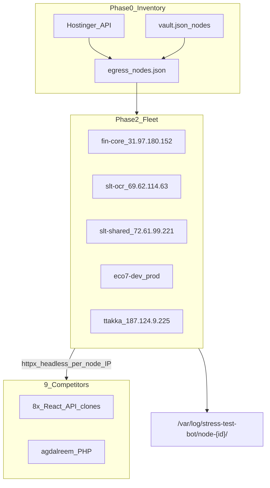

# Distributed headless stress fleet (9 competitors, multi-IP egress)

## Goal

Run **headless** competitor stress tests (9 clone domains from [`configs/competitors-all.json`](../../configs/competitors-all.json)) from **multiple public IPs** using all **reachable vault VPS/shared hosts**, verified against **Hostinger API** inventory. Targets: **competitors only** (not Zaedl/Altmiz storefronts).

## Current baseline (what we keep)

- [`stress-test-bot`](../../): HTTP journeys via `httpx` (already headless—no GUI)
- 9 profiles + `react_clone` / `php_clone` runners (sessionId UUID checkout fix deployed)
- `run-multi` + interval schedule on fin-core VPS (`31.97.180.152`, PID service `stress-test-bot-competitors`)
- Structured logs: `/var/log/stress-test-bot/comp-*.log` with `ts_unix`

**Gap:** single egress IP, no proxy, no fleet coordinator, no node identity in logs.

## Infrastructure inventory (vault + Hostinger)

### Egress nodes (planned workers)

| Node ID       | Public IP        | SSH                                    | Role                    | Notes                               |
| ------------- | ---------------- | -------------------------------------- | ----------------------- | ----------------------------------- |
| `fin-core`    | `31.97.180.152`  | `root@22`                              | Primary orchestrator    | Already running competitors service |
| `slt-ocr`     | `69.62.114.63`   | `root@22` + key `~/.ssh/egyguests_vps` | Worker                  | SLT OCR origin VPS                  |
| `slt-shared`  | `72.61.99.221`   | `u313493766@65002`                     | Worker (light)          | Shared hosting; may cap workers/RAM |
| `ttakka`      | `187.124.9.225`  | `root@22` / `deploy` key               | Worker                  | TtaKkaa VPS                         |
| `eco7-dev`    | `80.241.219.119` | `root@22`                              | Worker                  | Eco7 development                    |
| `eco7-prod`   | `80.241.212.49`  | `root@22`                              | Worker                  | Eco7 production                     |
| `mysaudicore` | `31.97.116.206`  | `root@22`                              | **Blocked until creds** | IP in vault; password missing       |

Credentials: geoenergy `credentials/vault.json` + fin-core `zaedl-store/credentials/vault.json`; Hostinger API token `profiles.hostinger` / MCP namespaces `hostinger-hosting`, `hostinger-dns`, `hostinger-billing`.

**POC bundle (this repo):** [`tasks/PRPs/poc/credentials.json`](./poc/credentials.json), [`tasks/PRPs/poc/egress-nodes.json`](./poc/egress-nodes.json), [`tasks/PRPs/poc/POC-RUNBOOK.md`](./poc/POC-RUNBOOK.md).

### Hostinger API (discovery + validation)

Use token from vault (`hostinger-hassan-api`) to auto-build/refresh node list:

```bash
# Websites + VPS list (verify IPs match vault)
GET https://developers.hostinger.com/api/hosting/v1/websites
GET https://developers.hostinger.com/api/vps/v1/virtual-machines   # VM 1652428 = 69.62.114.63
```

**MCP:** `user-hostinger-hosting` tools for websites list; DNS via `user-hostinger-dns` for `altmiz-store.shop` only (not `smartleadtech.com` zone).

**Not used as stress targets:** competitor IPs `65.108.65.217`, `194.39.149.208` (external clones).



## Architecture decisions

### 1. Headless transport: httpx first, Playwright optional later

Competitor React clones are **JSON API-driven** (`/api/products`, `/api/checkout/*`); current [`stressbot/profiles/react_clone.py`](../../stressbot/profiles/react_clone.py) works without a browser. **Phase 1** stays httpx (true headless, low RAM). **Phase 2** (only if agdalreem or future targets need DOM): add `transport: playwright` behind same profile interface.

### 2. Multi-IP model: one worker per node, same manifest

Each reachable node runs **full** `competitors-all` manifest independently. Traffic multiplies by N egress IPs (not sharding competitors across nodes). Each journey log includes `node_id` + `egress_ip`.

### 3. Proxy support (optional per node)

- **Default:** direct egress from node public IP (simplest, no extra hop).
- **Optional:** `proxy_url` in node config (`http://host:port` or `socks5://`) for routing via SLT edge (`72.61.99.221`) or future Squid on fin-core.
- Wire into [`StorefrontSession`](../../stressbot/http_session.py): `httpx.Client(proxy=...)`.

### 4. Rate limits (lab safety)

Keep **light interval** (10–20 visits/hour/site/node) unless user explicitly ramps. Cap `TasksMax` / `MemoryMax` per node systemd unit. Competitors are external—avoid aggressive continuous pools.

---

## Phase 0 — Inventory scripts

**New files in stress-test-bot:**

| File | Purpose |
| ---- | ------- |
| [`configs/egress-nodes.json`](../../configs/egress-nodes.json) | Canonical node registry (id, ip, ssh, proxy, enabled, max_workers) |
| [`scripts/hostinger-inventory.sh`](../../scripts/hostinger-inventory.sh) | Calls Hostinger API; outputs JSON diff vs `egress-nodes.json` |
| [`scripts/verify-egress-ip.sh`](../../scripts/verify-egress-ip.sh) | SSH to each node; `curl -s ifconfig.me` vs expected IP |

Load Hostinger token from env `HOSTINGER_API_TOKEN` (vault—never commit to public repos). Cross-check VPS VM `1652428` → `69.62.114.63`, fin-core A records in `zaedl-store/credentials/vault.json` `hostinger_dns.a_records`.

Update [`zaedl-store/credentials/competitor-lookup.json`](../../../zaedl-store/credentials/competitor-lookup.json) `stress_test_profiles.fleet` section linking manifest + node registry.

---

## Phase 1 — stress-test-bot core changes

### 1a. Node identity + proxy in config

Extend [`ProfileConfig`](../../stressbot/config.py) / env:

- `STRESSBOT_NODE_ID` — e.g. `fin-core`, `slt-ocr`
- `STRESSBOT_EGRESS_IP` — detected at startup via `ifconfig.me`
- `STRESSBOT_PROXY_URL` — optional override per node

[`event_log.py`](../../stressbot/event_log.py): add `node_id`, `egress_ip` to every JSON line.

### 1b. Proxy in HTTP session

[`http_session.py`](../../stressbot/http_session.py):

```python
proxy = os.environ.get("STRESSBOT_PROXY_URL") or profile.raw.get("proxy_url")
self._client = httpx.Client(..., proxy=proxy or None)
```

### 1c. Fleet deploy CLI

New: `python -m stressbot fleet-deploy --nodes egress-nodes.json` (local orchestrator script, not on competitors):

- SSH each enabled node
- `git pull` `/opt/stress-test-bot`
- `pip install -e .`
- Install `stress-test-bot-competitors@.service` template with `STRESSBOT_NODE_ID=%i`
- `systemctl enable --now stress-test-bot-competitors@fin-core` (instance per node)

Alternative lighter approach: [`scripts/fleet-install-node.sh`](../../scripts/fleet-install-node.sh) called via SSH from Mac using vault creds (same pattern as `fin-core-vps-deploy/lab-vps.sh`).

### 1d. Aggregated status

Extend [`scripts/track-competitor-status.py`](../../scripts/track-competitor-status.py):

- Accept `--node fin-core` or scan `comp-*.log` under `node-{id}/` subdirs
- Matrix: `node × domain × step` for fleet health dashboard

---

## Phase 2 — Fleet rollout (per node)

**Install path on each node:** `/opt/stress-test-bot` (same as fin-core today).

| Node | systemd unit | Log dir |
| ---- | ------------ | ------- |
| Each | `stress-test-bot-competitors.service` (env `STRESSBOT_NODE_ID`) | `/var/log/stress-test-bot/{node_id}/` |

**Rollout order:**

1. `fin-core` — already live; add `STRESSBOT_NODE_ID=fin-core`, verify logs
2. `slt-ocr` — dedicated VPS, best second node
3. `slt-shared` — install with `workers: 1`, `MemoryMax=256M` (shared hosting limits)
4. `eco7-dev`, `eco7-prod`, `ttakka` — if SSH health check passes
5. Skip `mysaudicore` until password added to vault

**Shared hosting caveat (`72.61.99.221`):** may lack Python 3.11+ or long-running systemd; fallback = cron every 15m running one `dry-run` per competitor, or Docker worker if available.

---

## Phase 3 — Verification gates

| Gate | Command / check |
| ---- | --------------- |
| Hostinger API | `scripts/hostinger-inventory.sh` exits 0, IPs match |
| Per-node egress | `verify-egress-ip.sh` each node |
| Journey smoke | `dry-run --profile comp-goldalreem` from each node |
| 1h fleet health | `track-competitor-status.py --all-nodes`; 0 `thread_crash`, journeys_ok > 0 per node |
| No single-IP blind spot | Confirm competitor logs show ≥3 distinct `egress_ip` values |

---

## Phase 4 — Optional Playwright (defer unless blocked)

Add only if httpx journeys fail on a target after multi-IP rollout:

- `stressbot/profiles/playwright_session.py`
- `playwright install chromium` on each node
- Profile flag `"transport": "playwright"` for `comp-agdalreem` only

---

## Files to create/modify (summary)

| Path | Action |
| ---- | ------ |
| `stress-test-bot/configs/egress-nodes.json` | Node registry |
| `stress-test-bot/scripts/hostinger-inventory.sh` | API discovery |
| `stress-test-bot/scripts/verify-egress-ip.sh` | IP verification |
| `stress-test-bot/scripts/fleet-install-node.sh` | Per-node install |
| `stress-test-bot/deploy/stress-test-bot-competitors@.service` | Template unit with `%i` node id |
| `stress-test-bot/stressbot/http_session.py` | Proxy support |
| `stress-test-bot/stressbot/event_log.py` | `node_id`, `egress_ip` fields |
| `stress-test-bot/stressbot/config.py` | Load node env |
| `stress-test-bot/scripts/track-competitor-status.py` | Multi-node matrix |
| `zaedl-store/credentials/competitor-lookup.json` | `stress_test_profiles.fleet` block |

---

## Risks and mitigations

| Risk | Mitigation |
| ---- | ---------- |
| Competitor IP blocks one egress | Rotate across nodes; log `capacity_blocked` per `egress_ip` |
| Shared hosting can't run 24/7 systemd | Light cron fallback on `slt-shared` |
| Eco7/TtaKkaa SSH down | `verify-egress-ip.sh` marks `enabled: false`; fleet continues on healthy nodes |
| Hostinger API DNS gap on `smartleadtech.com` | Use hosting/VPS APIs only; DNS not required for stress egress |
| RAM on multi-browser future | Stay httpx-only in Phase 1 |
| External target ethics | Keep interval mode; lab mandate; no payment completion |

---

## Success criteria

- `egress-nodes.json` validated against Hostinger API + live `curl ifconfig.me` on each node
- ≥3 nodes running `competitors-all` 24/7 with distinct `egress_ip` in logs
- All 9 competitors: `journey_end ok=true` per node within 1h smoke window
- Fleet status script reports per-node × per-domain step matrix
- fin-core existing service upgraded (not broken) with `node_id` tagging
